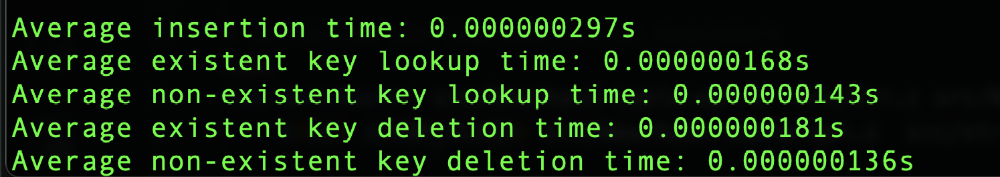
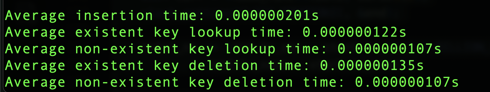

# x86-64-HashTable

## About The Project & Core Functionalities
This project involves an implementation of a hash table in x86-64 Assembly that uses chaining to handle collisions. The implementation involves all the core functionalities that any typical hash table has such as:
- Initialization
- A cutom string hashing algorithm that takes inspiration from the **djb2** hashing algorithm and Java's ```String hashCode()``` function
- Inserting a key-value pair
- Checking if a specific key exists
- Retrieving the value associated with an existing key
- Updating the value of an existing key
- Deleting a key-value pair
- Printing the contents of all slots in the hash table
- Clearing the contents of all slots in the hash table

## Quick Start
1. First clone the repository by entering the following in your terminal
```
git clone https://github.com/yourusername/x86-64-HashTable.git
```
2. To switch into the root directory type:
```
cd x86-64-HashTable
```

## Hash Table Structure

If you're interested in taking a look at the structs that are used to define the hash table, you should check out ```src/hash-table.h```. When you scroll down a bit past the constant definitions, you will see two structs declared: ```Node``` and ```Table```. Here are some important things to know about each of them:
1. ```Table```
    - The struct that actually defines the hash table that consists of 4 fields
    - ```long maxWords``` represents the maximum capacity of the hash table in terms of number of key-value pairs it can hold. This field is set by default from the start itself when the hash table is initialized and is used to dictate how many slots will be made available.
    - ```long nWords``` represents the current number of key-value pairs in the hash table
    - ```long nBuckets``` represents the number of slots available in the hash table. The value of this field is based on the ```maxWords``` field in order to ensure that space isn't wasted.
    - ```struct HashTableElement ** array``` represents the actual table into which new key-value pairs will be inserted. Each slot in the table contains a pointer to a chain of nodes
2. ```Node```
    - The struct that defines the contents of each slot in the hash table
    - ```char * word``` represents the key with ```long value``` representing the corresponding value.
    - ```struct HashTableElement * next``` represents a pointer to the next node in the chain. During the insertion process, new key-value pairs, if at all they hash to the same index are inserted at the end of the chain

## Project Structure
Since there are quite a few directories and files in this project, the visualization below provides a means to better understand the purpose of each file on a high level.
```
├── Makefile
├── README.md
├── src
│   ├── Benchmarks: Contains the files associated with benchmarking both the old and optimized x86-64 implementations
│   │   ├── benchmark.h
│   │   ├── hash-table-benchmark-old.c: For benchmarking the old x86-64 Assembly implementation
│   │   └── hash-table-benchmark-opt.c: For benchmarking the optimized x86-64 Assembly implementation
│   ├── New: Contains the files associated with the optimized implementation of the hash table
│   │   ├── hash-table-opt.c: Optimized implementation in C
│   │   └── hash-table-opt.s: Optimized implementation in x86-64 Assembly
│   ├── Old: Contains the files associated with the optimized implementation of the hash table
│   │   ├── hash-table-old.c: Old implementation in C
│   │   └── hash-table-old.s: Old implementation in x86-64 Assembly
│   ├── Utils: Contains files associated with a custom string function library
│   │   ├── str.c: In-line implementations for strlen, strncpy, strncmp, strdup
│   │   └── str.h
│   ├── Words: Contains files that will be used for benchmarking both the old and optimized x86-64 implementations
│   │   ├── 1000w.txt: List of 1000 unique words to be used for benchmarking insertion, lookup and delete
│   │   └── non-existent.txt: List of 500 unique words to be used for benchmarking lookup and delete
│   ├── hash-table.h
│   └── runall.c: Utility script used to run all the tests at once 
└── tests
    ├── New: Contains tests written for the optimized implementations of the hash table
    │   ├── hash-table-asm-test-opt.c: Optimized x86-64 implementation tests
    │   └── hash-table-c-test-opt.c: Optimized C implementation tests
    ├── Old: Contains tests written for the old implementations of the hash table
    │   ├── hash-table-asm-test-old.c: Old x86-64 implementation tests
    │   └── hash-table-c-test-old.c: Old C implementation tests
    └── tests.h
```

## Optimizations Implemented
Beyond the core functionalities implemented for the hash table several optimizations were also implemented. Here are some of the major ones:
1. Modified the bucket sizes used in the ```init``` function to all be a power of 2 instead of prime numbers
2. Made the hashing function run faster by using bitwise operations both in the main loop and at the end when performing remainder division
3. Inlined all the string functions being used such as ```strncmp```, ```strlen```, ```strncpy``` and ```strdup```.
4. Aligned all keys to 8 bytes(i.e, making them all 32 bytes) and modified ```strncmp``` to utilize long operations by comparing keys in chunks instead of using byte-by-byte operations
5. Decreased the number of memory accesses in the ```lookup()``` function by detaching a found node from its current position in the chain and re-attaching it at the head so that if the same key is looked up once again, a chain traversal isn't required.

The primary functions that were benchmarked were insertion, lookup and deletion since those are the key operations associated with a hash table and there were significant performance benefits as can be seen below:

- **Times recorded for the non-optimized x86-64 implementation**

- **Times recorded for the optimized x86-64 implementation**


Based on the times recorded above it can be seen how:
- **Insertion time** is reduced by **32%**
- **Lookup time** is reduced by **27%**
- **Deletion time** is reduced by **25%**

## Utilizing The Hash Table
If you would like to utilize the hash table, whether it is the old or the optimized x86-64 Assembly implementation, make sure to do the following:
1. In the new file which you create, make sure to specify the function prototypes for the ones you want to use prefixed with the ```extern``` keyword. All the assembly functions follow the same naming convention as the prototypes specified in ```src/hash-table.h``` with the exact same names and parameters. The only caveat is that each function name starts with **ASM_**. For example, if you want to initialize the hash table and insert a key-value pair, you would specify the prototypes as follows:
```
extern Table * ASM_init(long);
extern bool ASM_init(Table *, char *, long);
```
2. The above convention carries over to other functions as well. For example, if you want to use the lookup function, you'd add ```extern bool ASM_lookup(Table *, char *)``` as one of the function prototypes and so on... Once you've set up the necessary prototypes, you're ready to start using and testing the functions. Depending on whether you're using the functions associated with the old or optimized implementation, the compilation process will be a bit different but the function prototypes will remain the exact same. One thing you'll need to do if you don't include ```src/hash-table.h``` in the driver file is including it as a dependency in the compilation process.
    - If you're using the functions associated with the old x86-64 implementation:
        ```
        gcc -g -Wall src/Old/hash-table-old.s pathToYourDriverFile -o executableName
        ```
    - If you're using the functions associated with the optimized x86-64 implementation:
        ```
        gcc -g -Wall src/New/hash-table-opt.s pathToYourDriverFile -o executableName
        ```

## Running Tests & Benchmarks
One option you have for running tests is simply typing ```make``` in your terminal when you're in the root directory and then running each of the executables that end in **test** individually. However, you also have the option of running all tests at once. One main thing you must do before running all tests is running the ```make``` command from the root directory which will compile all the test scripts including the script used to run all the tests. Then, run the following executable in your terminal:
```
./runall
```
This script will only run the tests for which the executable is present and will throw an error for the non-existent ones which is why it's important to ensure they all are present before you do so. The ```make``` command also produces executables for running both the old and optimized x86-64 implementation benchmarks so if you'd like to run them do the following:
- Running the old benchmark
```
./old-benchmark
```
 - Running the optimized benchmark
```
./new-benchmark
 ```

In essence, for running the individual test and individual benchmarks or even for running all tests at once, make sure you run the ```make`` command from the root directory since it will produce all the executables necessary to run these.

## Contribution Guidelines
Even though this project has several associated components, there are still many things that can be done to improve it some of which include but aren't limited to:
- Implementing support for storing keys and values of different types
- Implementing a custom memory allocator and garbage collector
- Implementing benchmarking for other operations like ```get```, ```update```, ```delete``` etc
- Utilizing AVX instructions to make the assembly implementations even faster
- Implementing support for dynamic resizing when the load factor is exceeded
- Measuring memory usage as part of the benchmarking process
- Figure out more ways of minimizing memory access in other functions beyond ```lookup```

If you'd like to contribute to this project, there are a few things you will need to do:
1. Fork the repository and make any changes you want in a new branch
2. When proposing changes to be integrated with the repository, make sure to create a PR and add me as a reviewer